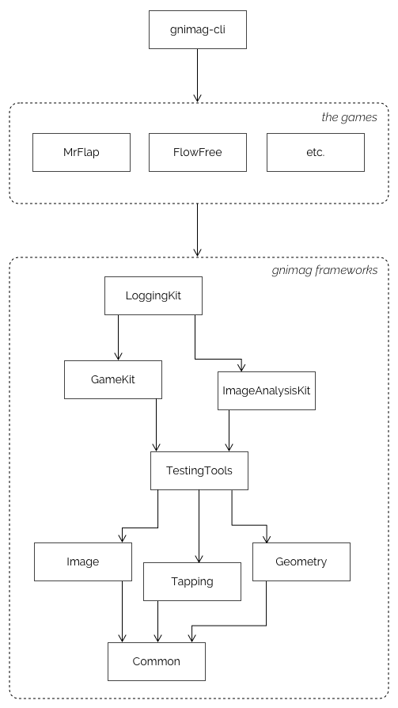

# Modularisation

The _gnimag_ project is highly modularised into different frameworks. When implementing a new game, you can use all of these framework functionality to perform common or essential tasks of your game implementation. For example:

- Use `ImageAnalysisKit` for analysing incoming images on a pixel-per-pixel basis in real-time, like simple edge-detection or performing bitmap-based OCR.

  `ImageAnalysisKit` is **not** a high-level, multi-purpose image analysis library like OpenCV, but is intended for real-time and low-level analysis of uncomplex images.

- Use `Geometry` to intersect lines and rays, or to calculate the distance of a point to various different kinds of shapes, like circles, rectangles and polygons. This is often useful during image analysis.

- Use `GameKit` to power your real-time frame-by-frame analysis process using a `GameQueue`. Use the powerful `SimpleTrackers` and `CompositeTrackers` to track all kinds of physical relations within the game (e.g. player movement, jumping) and to determine the exact parameters of the physical environment over time (e.g. player speed or acceleration, gravity and jump velocity).

  `GameKit` also provides a tap scheduling infrastructure which schedules and performs taps and keeps track of the input+output delay.

- Use `Common` to perform simple tasks that are too general to fit in any of the other libraries. For example, create or subscribe to `Event`s and `Promise`s; use `Timing` to schedule tasks and cancel them before execution; or use `Angle` to calculate intuitive things like the distance, the directed distance or the midpoint of two angles.

- Use `Image` and `Tapping` to access a common abstract interface that is used between games and external input/output components.

In addition to the just mentioned six base libraries, there are two libraries just for helping you debug your game implementation:

- Use `TestingTools` to draw all kinds of lines or shapes (those from `Geometry`) on images. This helps during implementing image analysis.

  Or use `TestingTools` to draw charts (using [`Charts`](https://github.com/danielgindi/Charts)) containing the data points and regression functions of your physics trackers, or draw any kind of complex picture on top of a chart, as long as it only uses partial functions and shapes.

- `LoggingKit` automates the process of collecting data for every single analyzed frame and logging interesting frames (e.g. frames that cause an error or lead to a player crash) on disk so you can analyze exactly what happened after it happened. The logs can be as detailed as you desire, consisting of texts and images, for example containing all your tracker data and regressions, both textually and visually. Such detailed logs are often essential in finding bugs which are related to physics tracking or tap prediction.

The _gnimag_ Xcode project contains a target for each of these frameworks. Also, every game is implemented as a single target. At the top of the dependency chain is the _gnimag-cli_ command-line executable.

Here is the module/target dependency graph:

	

A game is high-level module which has access to all the aforementioned frameworks provided by the _gnimag_ project.

_gnimag-cli_ is a command-line tool which just calls the entry point of whatever game it wants to play. In addition, _gnimag-cli_ provides actual implementations for the interfaces that `Image` and `Tapping` are defining: _gnimag-cli_ contains components that interact with the Mac screen and with the mouse. For example, `WindowInteractor`s let _gnimag-cli_ read content from and perform taps on specific windows, like screen-sharing applications.

Why do games interact with interfaces for input (`Image`) and output (`Tapping`)? Obviously, the games do not know which method of input and output the user playing the game will be using. For example, he could both use a robot or a screen-sharing program to tap on the smartphone, and he could both use a camera or a screen-sharing program to receive an image stream. The user can switch between whatever setup he likes by just providing adequate `ImageProviders` or `Tappers`.

