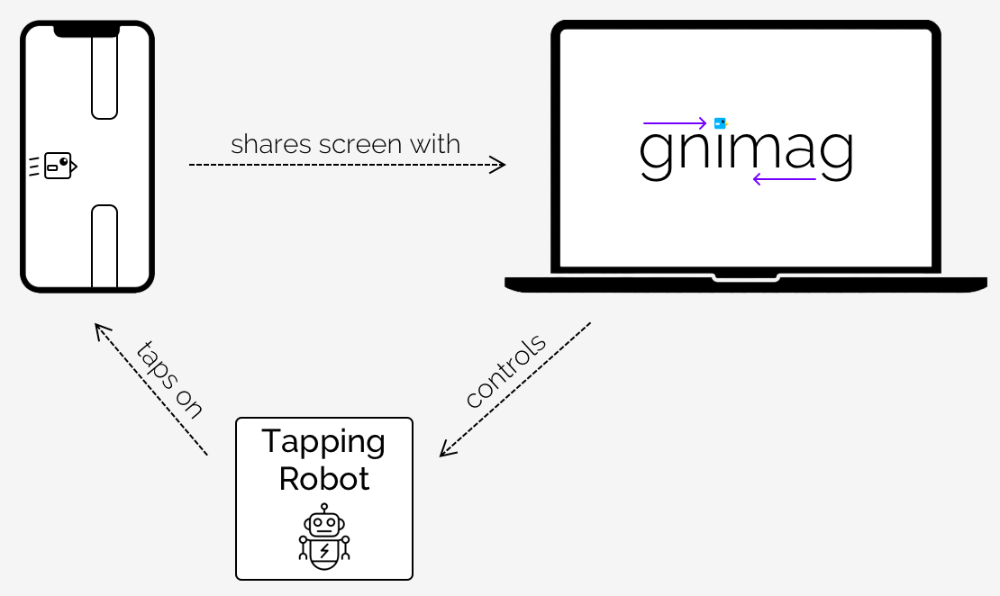

	

**_gnimag_ is an intelligent game auto-player**. It is the _software_ component in this multi-part, real-time _game autoplaying system_:

	

- The smartphone runs a game, say _MrFlap_. It shares its screen with the computer.
- _gnimag_ is running on the computer. It continuously analyses the smartphone screen and calculates when exactly the robot should tap on the screen to try surviving as long as possible.
- Every tap that _gnimag_ schedules is performed by the tapping robot.

In this process, _gnimag_ considers every little detail. For example, there is a noticeable delay between the real-time game on the smartphone and the video stream that is received by the screen sharing program. There is a small additional delay involved between telling the robot to perform a tap and the tap actually being performed on the smartphone. _gnimag_ measures, and continuously updates, these delays and considers them when calculating the perfect moments for tapping.

_gnimag_ currently holds the **world record** in the following games:

- Todo.

Do you want to try _gnimag_ for yourself? Go through the [Tutorial]. **You do NOT need a robot in order to run _gnimag_**. If you own an Android device or Windows Phone, the screen sharing program can simulate tapping your smartphone, so there is no need for a robot. You DO need a robot if you want to run _gnimag_ on an iPhone, however.

## TLDR: How Do I Run _gnimag_ on My Computer?

See here: [Tutorial: 5 Simple Steps]

## Documentation

If you're new to _gnimag_, you can read on how it works or how you execute it:

- ❓ Tutorial
- 💡 How Does _gnimag_ Work

If you want to contribute to _gnimag_ (for example, implement _gnimag_ for a new game, or fix existing bugs), have a look here:

- ⚙️ Technical Documentation
- 👩‍💻 Developing
- (🐦 Explaining the _MrFlap_ Implementation ?)

Finally, here is a list of world records which are held by _gnimag_ and a list of all games which are implemented or currently in progress:

+ 🏆 World Records
+ 🎳 Implemented Games

Also, if you discover a bug or have a question or game idea, [write an issue](https://github.com/piknotech/gnimag/issues/new) or [contact me](https://github.com/knothed).

Enjoy!