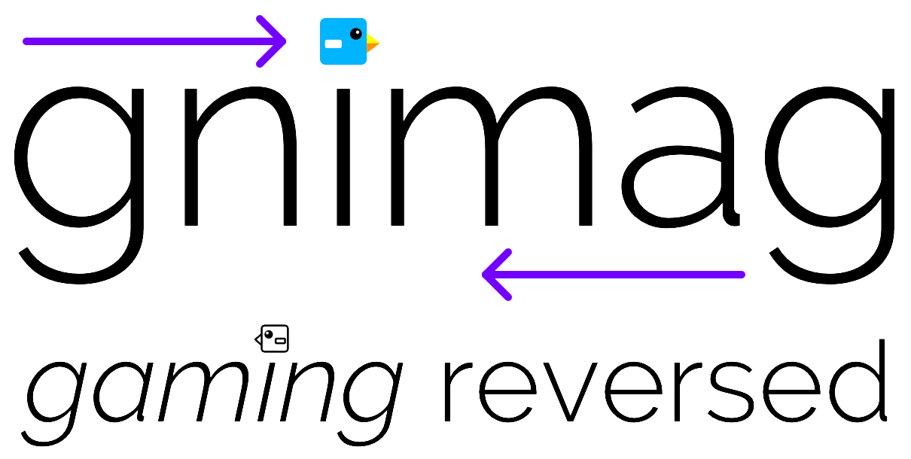

	

    
    
    
    </a>

**_gnimag_ is an intelligent game auto-player. It holds [world records](Documentation/WorldRecords.md) in multiple smartphone games**. _gnimag_ is the software component in this multi-part, real-time _game autoplaying system_:

	

- The smartphone runs a game, say _MrFlap_. It shares its screen with the computer.
- _gnimag_ is running on the computer. It continuously analyses the smartphone screen, deduces the game's physics parameters and calculates exactly when the screen must be tapped to survive as long as possible.
- Every tap that _gnimag_ schedules is performed by the tapping robot.

In this process, _gnimag_ considers every little detail. For example, there is a noticeable delay between the real-time game on the smartphone and the video stream that is received by the screen sharing program. There is a small additional delay involved between telling the robot to perform a tap and the tap actually being performed on the smartphone. _gnimag_ measures, and continuously updates, these delays and considers them when calculating the perfect moments for tapping.

_gnimag_ holds active world records in various games. Click [here](Documentation/WorldRecords.md) to see them all! 🏆

## How Do I Run _gnimag_ Myself?

Go through the [Tutorial](Documentation/Tutorial.md).

**You do NOT need a robot in order to run _gnimag_**. If you own an Android device or Windows Phone, the screen sharing program can simulate tapping your smartphone, so there is no need for a robot. You DO need a robot if you want to run _gnimag_ on an iPhone, however.

## Documentation

If you're new to _gnimag_, you can read on how it works or how you execute it:

- ❓ [Tutorial](Documentation/Tutorial.md)
- 💡 [How Does _gnimag_ Work](Documentation/HowDoesGnimagWork.md)

If you want to contribute to _gnimag_ (for example, implement _gnimag_ for a new game, or fix existing bugs), have a look here:

- ⚙️ [Modularisation](Documentation/Modularisation.md)
- 👩‍💻 [Developing](Documentation/Developing.md)
- 🐦 [Explaining the _MrFlap_ Implementation](Documentation/ExplainingMrFlap.md)

Finally, here is a list of world records which are held by _gnimag_ and a list of all games which are implemented or currently in progress:

- 🏆 [World Record Collection](Documentation/WorldRecords.md)

+ 🎳 [Implemented Games](Documentation/ImplementedGames.md)

Also, if you discover a bug or have a question or game idea, [write an issue](https://github.com/piknotech/gnimag/issues/new) or [contact us](http://piknotech.com/contact.html).

Enjoy!
