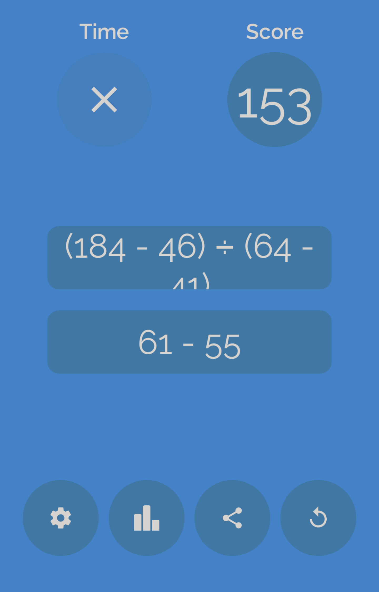

# YesNoMathGames

YesNoMathGames bundles math games where the player must solve as many yes/no math exercises as possible. Thereby, an exercise consists of two expressions, and the player must decide whether they are equal or not and press the respective button.

These games only differ in their image analysis process.

Currently implemented: identiti and Freaking Math.

## identiti

[App Store](https://apps.apple.com/de/app/identiti/id909914922); [Play Store](https://play.google.com/store/apps/details?id=de.chipsapps.ca.identiti).

### Notice:
On Android, sometimes, long terms are erroneously spread over two lines and are unreadable, even for humans (without guessing). Then, an analysis or parsing error will be printed to the Terminal; the user must then decide where to tap.

This does not happen on iOS.

## Freaking Math

[App Store](https://apps.apple.com/us/app/freaking-math/id846439108); [Play Store](https://play.google.com/store/apps/details?id=com.bangdev.freakingmath).

On iOS, there also exists _Freaking Math+_, where the player has even less time per question. Because of its similarity, it can also be played with this module.

[Freaking Math+](https://apps.apple.com/us/app/freaking-math/id854825595)
