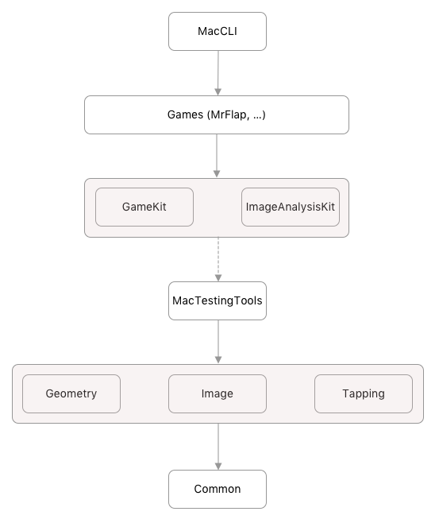

Here lives the Xcode project.

The project uses Swift 5.1.3; you need Xcode 11 for building and running gnimag.

All libraries are defined as targets. Dependencies are managed via Xcode, using SPM.

To create a new library, create a new target and choose `macOS -> Framework`.

To build the project, you can either build all targets at once with the `All` scheme, or build each target separately.

This is the module/target import graph:

All import relations are transitive. Build the graph from the bottom to the top, or use the `All` scheme.
